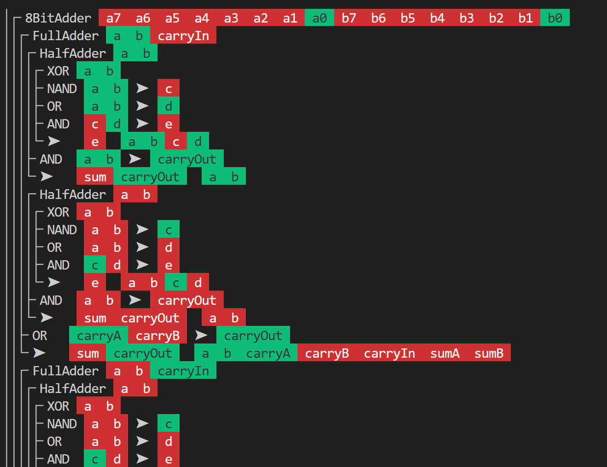

# Chips

A basic logic circuit simulator written in C++.  
A descendant of my previous logic circuit simulators: [CircuitSim](https://github.com/phunanon/CircuitSim), [Sircuit](https://github.com/phunanon/Sircuit), [CCircuit](https://github.com/phunanon/CCircuit).  
Variadic primitives: `NAND AND OR NOR ->`
Command-line flags: `--debug --echo-chips`

```bash
g++ main.cpp
./a.out chips/* Computer.chip
```

## Examples



```
$ ./a.out Computer.chip chips/*
█ █ █▀ █  █  █▀█
█▀█ █▀ █  █  █ █
▀ ▀ ▀▀ ▀▀ ▀▀ ▀▀▀
1 + 1 = 2
```
